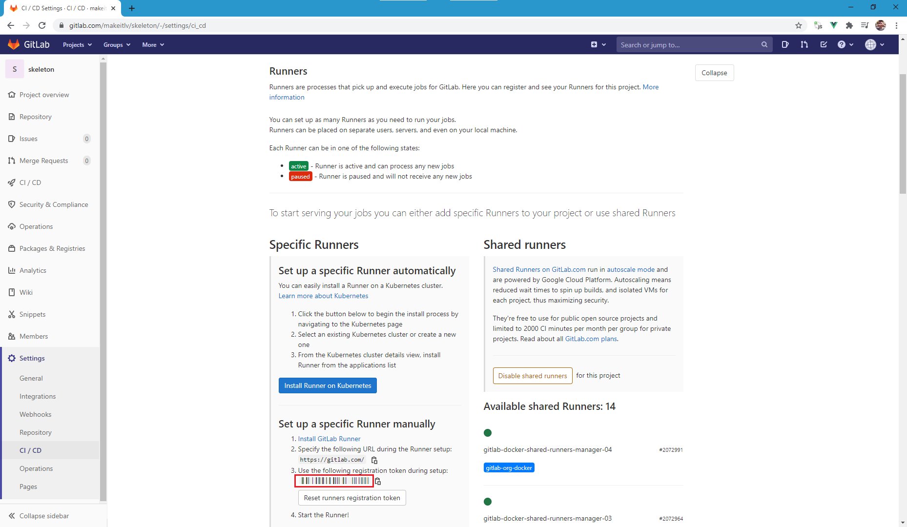
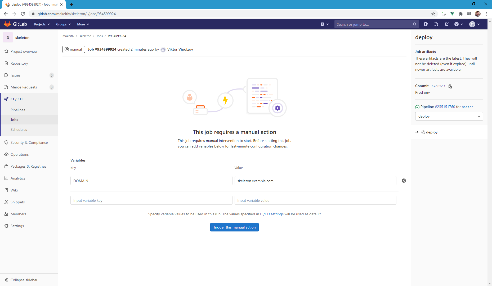

## Requirements
* [Git](https://git-scm.com/downloads)
* [Docker](https://docs.docker.com/engine/install/)
* [Docker Compose](https://docs.docker.com/compose/install/)
* [WSL2](https://docs.microsoft.com/en-us/windows/wsl/install-win10) - only Windows 10

## Dev development
#### Step 1 - build docker image
```bash
cd /path/to/project

docker-compose build
```

#### Step 2 - copy generated files (.env, vendor and var) from image to host
```bash
for FILE in {.env,vendor,var};
  do docker cp $(docker create --rm boilerplate:latest):/var/www/html/${FILE} ${PWD}/${FILE}
done
```

#### Step 3 - run image
```bash
docker-compose up -d
```

You are done and ready to create your best application.

### Running command
```bash
docker exec web command
```
e.g.
```bash
docker exec web composer install
```

Execute command without running image
```bash
docker run --rm --interactive --tty --volume ${PWD}:/var/www/html -w /var/www/html boilerplate:latest command
```

### Utils
Reset PHP workers in the container (to reload your PHP source code)
```bash
docker exec web rr -c .rr.dev.yaml http:reset
```
Show PHP workers' status
```bash
docker exec web rr -c .rr.dev.yaml http:workers -i
```

### Auto-Reloading
Auto reloading is enabled by default. RoadRunner detects PHP file changes and reload connected services.
To turn off this feature, remove the `reload` section in .rr.dev.yaml.

See: [Roadrunner: Auto-Reloading](https://roadrunner.dev/docs/beep-beep-reload)

## Prod environment

#### Step 1 - Create a vps droplet

#### Step 2 - Bind a domain name with an ip

#### Step 3 - Get gitlab runner registration token
1. Go to https://gitlab.com/username/repository/-/settings/ci_cd
2. Expand runners
3. Copy registration token
   

#### Step 4 - SHH into your server
```bash
ssh username@server-ip
```

#### Step 5 - Install docker using the repository
Update the apt package index and install packages to allow apt to use a repository over HTTPS:
```bash
sudo apt-get update
sudo apt-get install \
    apt-transport-https \
    ca-certificates \
    curl \
    gnupg-agent \
    software-properties-common
```
Add Docker’s official GPG key:
```bash
curl -fsSL https://download.docker.com/linux/ubuntu/gpg | sudo apt-key add -
```
Verify that you now have the key with the fingerprint **9DC8 5822 9FC7 DD38 854A  E2D8 8D81 803C 0EBF CD88**, by searching for the last 8 characters of the fingerprint.
```bash
sudo apt-key fingerprint 0EBFCD88
```
```bash
pub   rsa4096 2017-02-22 [SCEA]
      9DC8 5822 9FC7 DD38 854A  E2D8 8D81 803C 0EBF CD88
uid           [ unknown] Docker Release (CE deb) <docker@docker.com>
sub   rsa4096 2017-02-22 [S]
```
Use the following command to set up the stable repository:
```bash
sudo add-apt-repository \
   "deb [arch=amd64] https://download.docker.com/linux/ubuntu \
   $(lsb_release -cs) \
   stable"
```
Update the apt package index, and install the latest version of Docker Engine and containerd:
```bash
sudo apt-get update
sudo apt-get install docker-ce docker-ce-cli containerd.io
```

#### Step 6 - Install docker-compose
```bash
sudo curl -L "https://github.com/docker/compose/releases/download/1.27.4/docker-compose-$(uname -s)-$(uname -m)" -o /usr/local/bin/docker-compose
sudo chmod +x /usr/local/bin/docker-compose
```

#### Step 7 - Manage Docker as a non-root user
Create the docker group
```bash
sudo groupadd docker
```
Add your user to the docker group
```bash
sudo usermod -aG docker $USER
```
Log out and log back in so that your group membership is re-evaluated. Or you can also run the following command to activate the changes to groups:
```bash
newgrp docker
```

#### Step 8 - Install GitLab Runner
```bash
curl -L https://packages.gitlab.com/install/repositories/runner/gitlab-runner/script.deb.sh | sudo bash
sudo apt-get install gitlab-runner
sudo gitlab-runner start
```
Add gitlab-runner user to docker group:
```bash
sudo usermod -aG docker gitlab-runner
```

#### Step 9 - Register a pipeline
To register a pipeline, run the following command (where **REGISTRATION_TOKEN** paste token from step 1):
```bash
sudo gitlab-runner register -n \
  --url https://gitlab.com/ \
  --registration-token REGISTRATION_TOKEN \
  --executor docker \
  --docker-image makeitlv/php:8.0.0 \
  --docker-volumes "/var/run/docker.sock:/var/run/docker.sock" "/cache"
```

#### Step 10 - Check CPU threads
```bash
 echo "$(grep -c processor /proc/cpuinfo)"
```

#### Step 11 - Change numWorkers to count of CPU threads
```yaml
http:
    ...
    workers:
        ...
        pool:
            numWorkers: COUNT_OF_CPU_THREADS
```

#### Step 12 - Clone reverse-proxy and run it
```bash
git clone git@gitlab.com:makeitlv/reverse-proxy.git
docker network create proxy
DOMAIN=monitor.example.com EMAIL=your@email.com docker-compose -f ./reverse-proxy/docker-compose.yml up -d
```

#### Step 13 - Deploy changes to prod
1. Commit and push changes
```bash
git checkout master
git add .
git commit -m "Prod"
git push origin prod
```
2. Go to https://gitlab.com/username/repository/-/pipelines 
3. Click on deploy manual
4. Set DOMAIN variable - boilerplate.example.com


## Troubleshooting
If website is not started check that application and traefik are running:
```bash
docker ps
```

If they are running check logs:
```bash
docker logs traefik
```

If there are no errors, the most key may be that need to restart traefik:
```bash
docker stop traefik
DOMAIN=monitor.example.com EMAIL=your@email.com docker-compose -f ./reverse-proxy/docker-compose.yml up -d
```
